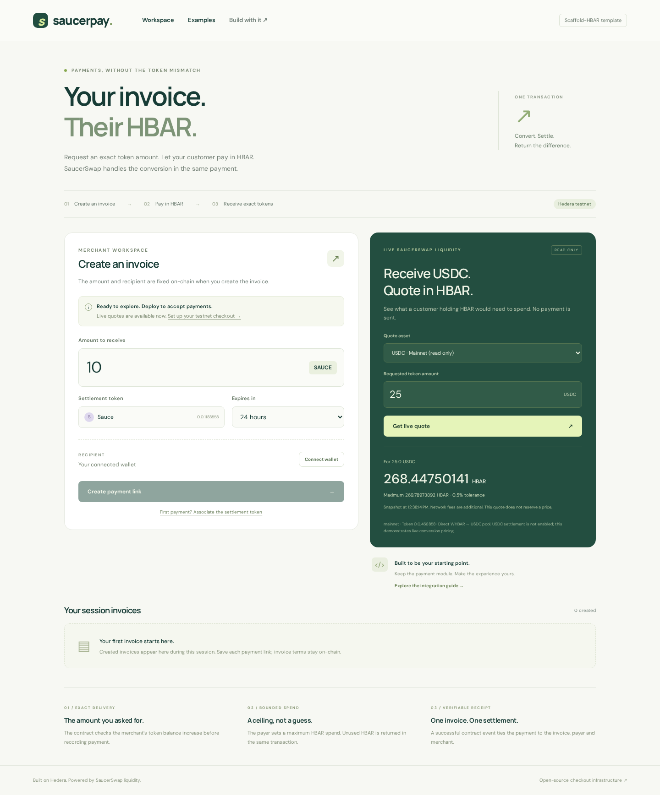
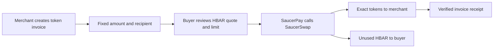

# SaucerPay

**Let customers pay in HBAR while your app receives an exact amount of an HTS token.**

A [Scaffold-HBAR](https://docs.hedera.com/solutions/tools/scaffold-hbar/index) template for payment links and checkout flows, using SaucerSwap liquidity. The invoice workspace demonstrates the pattern; the TypeScript package and Solidity contract are the parts you reuse.

**[Open the live demo](https://saucerpay-hedera.vercel.app)** · **[Start locally](docs/GETTING_STARTED.md)** · **[Understand the flow](docs/ARCHITECTURE.md)** · **[Adapt it](docs/CUSTOMIZATION.md)**



## What can I try now?

| Capability                                                  | Available                                                      |
| ----------------------------------------------------------- | -------------------------------------------------------------- |
| Open the hosted app and request real testnet/mainnet quotes | Yes — no installation or wallet                                |
| Install, run tests, build and explore the source            | Yes — no key required                                          |
| Create, cancel and pay invoices on testnet                  | Implemented; requires your funded wallet and deployed checkout |
| Inspect a published SaucerPay payment transaction           | Not yet — testnet evidence is pending                          |
| Pay invoices on mainnet                                     | Not enabled in this template                                   |

The example receives **SAUCE**, not dollars. It is a convenient testnet asset, not a stablecoin. The USDC preview reads real mainnet liquidity; USDC settlement is still an adaptation requiring deployment and payment validation. [Validation record](docs/VALIDATION.md).

## Who should start here?

Use this template when building payment links, a service checkout or prepaid credits **where the buyer has HBAR and the seller requires another token**. You get a fixed recipient and amount, a conversion quote, a maximum HBAR spend, surplus return and a verifiable payment receipt.

SaucerSwap supplies the conversion and existing pool liquidity. Removing it removes the ability to settle a token-denominated order with HBAR. SaucerPay supplies the invoice-specific checks around that integration. If both parties already use the same asset, a direct transfer can be simpler. [Use cases, evidence and tradeoffs](docs/USE_CASES.md).

## Run your own copy

Prerequisites: **Node.js 22+**, npm, Git and internet access. The generator initializes a Git repository, so configure your Git author identity if you have not already done so. No Hedera account is needed for this first step.

```bash
npx create-scaffold-hbar@latest --template STOOOKEEE/hedera-temlate
```

Choose a project name and accept Next.js, Hardhat and npm. After installation:

```bash
cd your-project
npm run dev
```

Open **http://localhost:3000**. In the quote panel, choose **SAUCE · Testnet**, enter `1` and click **Get live quote**. You should see the HBAR needed for 1 SAUCE, a maximum spend and a timestamp. Prices change; a failed network call displays an error, never a sample price.

**Create payment link is disabled until you configure a contract. This is expected.** Continue with [the first-run walkthrough](docs/GETTING_STARTED.md) or [deploy on testnet](docs/DEPLOYMENT.md).

Prefer a direct clone?

```bash
git clone https://github.com/STOOOKEEE/hedera-temlate.git
cd hedera-temlate
npm ci
npm run dev
```

## How a payment works



Invoice creation is one merchant transaction. **Settlement is one payer transaction** that converts HBAR, checks the merchant's received amount and returns unused HBAR. If a settlement check fails, the payment transaction reverts; network fees can still be charged.

A quote alone is not payment. Fulfill an order only after checking a successful receipt against the configured contract and invoice. [Sequence, trust boundaries and Hedera units](docs/ARCHITECTURE.md).

## Find the right guide

| I want to…                                                 | Read                                       |
| ---------------------------------------------------------- | ------------------------------------------ |
| Get from a fresh scaffold to a live quote                  | [Getting started](docs/GETTING_STARTED.md) |
| Fund a wallet, deploy, create and pay an invoice           | [Testnet deployment](docs/DEPLOYMENT.md)   |
| Understand atomic settlement, association and amount units | [Architecture](docs/ARCHITECTURE.md)       |
| Replace the UI, change the token or fulfill an order       | [Customization](docs/CUSTOMIZATION.md)     |
| Look up env vars, API routes, events and helper functions  | [Reference](docs/REFERENCE.md)             |
| Resolve setup, quote, wallet or receipt errors             | [Troubleshooting](docs/TROUBLESHOOTING.md) |
| Host my copy on Vercel                                     | [Web hosting](docs/HOSTING.md)             |
| Prepare the pitch, demo and verified receipt               | [Submission package](docs/SUBMISSION.md)   |
| Evaluate the template for the bounty                       | [Reviewer walkthrough](docs/REVIEW.md)     |
| Work with a coding agent                                   | [AGENTS.md](AGENTS.md)                     |

The [product examples](https://saucerpay-hedera.vercel.app/examples) use the same `QuotePreview` component for a service invoice and a prepaid-credit purchase. Quotes are read-only; your application supplies order persistence and fulfillment.

## Where to change the code

| Location                                                                                     | Responsibility                                                                               |
| -------------------------------------------------------------------------------------------- | -------------------------------------------------------------------------------------------- |
| [`packages/checkout/src/index.ts`](packages/checkout/src/index.ts)                           | Quotes, amounts, deployment/association checks, payment transaction and receipt verification |
| [`packages/checkout/examples/quote.ts`](packages/checkout/examples/quote.ts)                 | Runnable quote example with no credentials                                                   |
| [`packages/hardhat/contracts/SaucerPay.sol`](packages/hardhat/contracts/SaucerPay.sol)       | Invoice terms, cancellation and atomic settlement                                            |
| [`packages/nextjs/components/QuotePreview.tsx`](packages/nextjs/components/QuotePreview.tsx) | Reusable live conversion preview with explicit asset/network presets                         |
| [`packages/nextjs/components/Workspace.tsx`](packages/nextjs/components/Workspace.tsx)       | Merchant workspace and quote preview                                                         |
| [`packages/nextjs/components/Payment.tsx`](packages/nextjs/components/Payment.tsx)           | Payer flow and receipt recovery                                                              |
| [`packages/nextjs/app/api`](packages/nextjs/app/api)                                         | Server-side reads; no server signing key                                                     |

## Check your changes

From the repository root:

```bash
npm run lint
npm test
npm run build
```

In two terminals, run `npm start` and then `npm run smoke`. Use `npm run probe` for real read-only quotes. The current suite has 19 TypeScript tests and 11 contract tests; local contract tests use mocks, not Hedera precompiles. [Exact evidence and remaining checks](docs/VALIDATION.md).

## Scope and license

One configured fungible HTS token per deployment, without custom transfer fees, reached through a direct SaucerSwap V1 WHBAR pool. The example uses an injected EVM wallet such as MetaMask; HashPack/WalletConnect is not integrated. Invoice history in the workspace is temporary browser state. A production order database, credit ledger, subscription scheduler and fulfillment system are application extensions.

The contract is unaudited. Mainnet signing is disabled in the reference flow. **A genuine testnet transaction is still needed before the bounty submission is complete.**

[MIT](LICENSE). Protocol references and design decisions are linked in [Architecture](docs/ARCHITECTURE.md); the original implementation plan is in [IMPLEMENTATION_PLAN.md](IMPLEMENTATION_PLAN.md).
