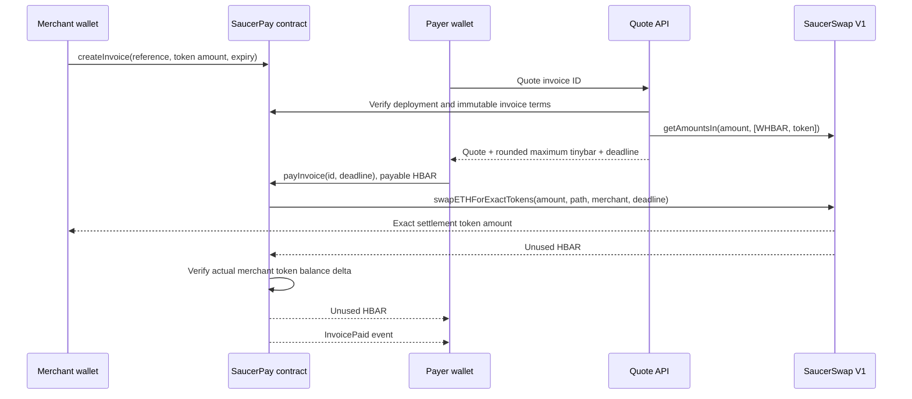

# Payment architecture

[README](../README.md) · [API reference](REFERENCE.md) · [Customization](CUSTOMIZATION.md)

**Pattern:** convert the payer's HBAR into the invoice's exact token amount and record settlement in the same transaction. The merchant creates the invoice beforehand. A quote is a read, not a reservation of liquidity.

## Components and trust

| Component                 | Responsibility                                                   | What it cannot prove                                                  |
| ------------------------- | ---------------------------------------------------------------- | --------------------------------------------------------------------- |
| Browser + injected wallet | Show terms and obtain user signatures                            | A browser success message is not payment evidence                     |
| Next.js API               | Read configured contracts, mirror metadata and receipts          | A preflight cannot guarantee future liquidity or permission state     |
| Shared checkout package   | Validate amounts/config, quote, build payment and verify receipt | Does not authenticate your application's customer or fulfill an order |
| SaucerPay contract        | Store immutable invoice terms and enforce settlement checks      | Does not ship goods, grant credits or reverse completed payments      |
| SaucerSwap V1             | Execute exact-output conversion using existing liquidity         | Does not know your application's order or fulfillment state           |
| Mirror node / RPC         | Expose metadata, contract state and transaction results          | Reads can lag or fail; a timeout is not a reverted transaction        |

The server holds no signing key. Only wallets sign in the reference UI. The deployment scripts separately use a local testnet key.

## Transaction sequence

## Source of truth

The contract stores invoices. References are random bytes32 in the demo; IDs are `keccak256(abi.encode(merchant, reference))`. Merchant namespaces prevent another account reserving someone else's reference. Creating the same invoice reference twice for one merchant is rejected, including after cancellation or payment.

The token, router and WHBAR token address are immutable for a deployment. An invoice fixes merchant, output amount and expiry. Only the merchant can cancel. Only open, unexpired invoices can be paid. The payment deadline must also be within the invoice lifetime.

Invoice status is set before external calls and protected by a reentrancy guard. Any swap, balance-check or refund failure reverts the transaction, including that state update. There is no background worker that must reconcile a partially completed swap and transfer.

## Amount units

| Boundary                                                           | Unit                                              |
| ------------------------------------------------------------------ | ------------------------------------------------- |
| Invoice output and ERC20-compatible HTS methods                    | Token smallest unit, determined by token decimals |
| SaucerSwap `getAmountsIn()[0]`                                     | Tinybar (8 decimal places per HBAR)               |
| Hedera EVM `msg.value`, `address.balance`, Solidity internal sends | Tinybar                                           |
| Ethereum JSON-RPC transaction `value`                              | Weibars / RPC wei (18 decimal places per HBAR)    |

`tinybarToRpcWei` performs the **single** conversion at the wallet boundary: multiply by 10^10. `maximumSpend` rounds upward with integer arithmetic. ABI values remain in their actual native units. See the official [Hedera transaction unit documentation](https://docs.hedera.com/hedera/sdks-and-apis/sdks/smart-contracts/ethereum-transaction).

### Worked example (illustrative arithmetic, not a live quote)

For a 6-decimal token, `1.25` tokens means `1_250_000` output units. Suppose the router quotes `100_000_000` tinybar (1 HBAR). At 50 basis points (0.5%), the maximum is `100_500_000` tinybar. The wallet transaction's RPC `value` is `1_005_000_000_000_000_000` wei. Only native HBAR gets that conversion; the output stays `1_250_000` token units.

The router spends no more than the supplied cap. Any unused HBAR returns to the payer within settlement. Network fees are additional and are not part of this refund. A failed payment reverts its token/native transfers and invoice status, but can still incur network fees.

## Integration choices

SaucerSwap V1 RouterV3 provides an exact-output HBAR method with automatic surplus refund. The path is exactly `[WHBAR HTS token, settlement token]`. The WHBAR wrapper contract and the WHBAR HTS token are different addresses: path construction uses the token.

The application reads a current quote from the real router and checks the settlement token's metadata. For invoice payment it also checks the deployed immutable configuration, invoice state and merchant's token relationship through the mirror node. It does not assert that a successful quote guarantees successful execution: balances, association policy and liquidity can change.

The contract receives no settlement tokens: the router delivers directly to the merchant. This avoids requiring the checkout contract to associate every output asset. Before/after balance checks enforce exact receipt and reject under-delivery, including ordinary transfer-fee effects. The UI rejects tokens declaring custom fees before quoting.

## Proof and recovery

After submission the payment page stores the transaction hash in the URL before waiting for a receipt. Refreshing reads the on-chain invoice and verifies the receipt independently through the server's RPC endpoint. Verification checks successful status, destination, event emitter, invoice ID, merchant and output amount. It never interprets a bare transaction hash as success.

If a receipt is not available, keep the transaction hash and refresh; do not blindly resubmit. If a transaction is confirmed reverted, its invoice remains open and the `tx` query parameter can be removed to request a new quote. Off-chain fulfillment needs an idempotent server-side order update keyed by chain ID, checkout address and invoice ID; see CUSTOMIZATION.md.

## Deliberate limitations

No fee-on-transfer assets, route optimization, order indexing service, account abstraction or mainnet signing. No HTS emulation is claimed for Hardhat unit tests. A production merchant should review token admin controls and deployment code; this starter is not audited.

Expiry is computed at read/payment time; no scheduler submits an expiry transaction. The merchant can cancel an invoice still stored as Open even after its expiry, but it can no longer be paid. The quote's 60-second lifetime is a client/package policy; the contract enforces the signed deadline against the invoice expiry.

## Terms used in the guides

| Term                   | Meaning here                                                                                                                           |
| ---------------------- | -------------------------------------------------------------------------------------------------------------------------------------- |
| HTS                    | Hedera Token Service; the settlement asset is a fungible HTS token                                                                     |
| Association            | An account's relationship to a token, required by this flow before the merchant can receive it; different from ERC20 spending approval |
| Exact output           | Merchant amount is fixed; HBAR required to obtain it varies                                                                            |
| Slippage allowance     | Extra permitted HBAR spend if price changes; not an automatic extra fee                                                                |
| Atomic settlement      | Conversion, exact receipt check, status update and surplus refund all succeed or revert together                                       |
| Receipt                | A successful transaction result containing the expected contract event                                                                 |
| Idempotent fulfillment | Reprocessing payment evidence does not ship twice or credit an account twice                                                           |

## Protocol references

- [SaucerSwap exact-output HBAR swaps](https://docs.saucerswap.finance/developers/v1/swap/swap-hbar-for-tokens)
- [SaucerSwap deployed contracts](https://docs.saucerswap.finance/developers/contracts)
- [Hedera Ethereum transaction units](https://docs.hedera.com/hedera/sdks-and-apis/sdks/smart-contracts/ethereum-transaction)
