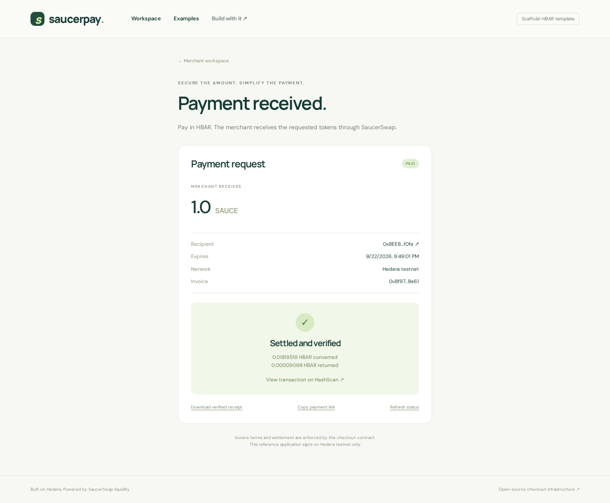

# Validation record

[README](../README.md) · [Reviewer walkthrough](REVIEW.md)

## Live testnet deployment and payment — 2026-09-22

The reference checkout is deployed on Hedera testnet (chain 296) at
`0x92eD50589e2c594c8417234818B6FD7fDEA69334`. The configured settlement
asset is SAUCE (`0.0.1183558`, six decimals), reached through the real
SaucerSwap V1 testnet router (`0.0.19264`). No mainnet payment is claimed.

| Evidence                  | Public result                                                                                                                                                                                                                                                                                      |
| ------------------------- | -------------------------------------------------------------------------------------------------------------------------------------------------------------------------------------------------------------------------------------------------------------------------------------------------- |
| Contract deployment       | [Successful Hedera Mirror Node result](https://testnet.mirrornode.hedera.com/api/v1/contracts/results/0xf810bf564aab4a305b30af5ddff6f95ed87aa8776a439a256f7c846cbb50c136)                                                                                                                                                      |
| Merchant-created invoice  | [Successful Hedera Mirror Node result](https://testnet.mirrornode.hedera.com/api/v1/contracts/results/0xdcab8b3a722e14191dcbdaca9b0db7ab4d22ec1c5687ee60b2690c143e027a8b)                                                                                                                                                      |
| Separate-payer settlement | [Successful Hedera Mirror Node result](https://testnet.mirrornode.hedera.com/api/v1/contracts/results/0xd9d3d092b020d8d0e05825f7636f1be6085d3e935a18d2286d4a5448f42a85d1) · [HashScan](https://hashscan.io/testnet/transaction/0xd9d3d092b020d8d0e05825f7636f1be6085d3e935a18d2286d4a5448f42a85d1) |
| Hosted receipt            | [Paid invoice with matching transaction](https://saucerpay-hedera.vercel.app/pay/0x8f97d7a7c61394e9f927e2b0d9d7b62fc396d091cfffc0475ab3b13493b58e61?tx=0xd9d3d092b020d8d0e05825f7636f1be6085d3e935a18d2286d4a5448f42a85d1)                                                                         |

The merchant was `0x8EE8292BDD3E80Af225c2a91Afcc45ccA800f0fe`; the separately
funded payer was `0x43937DB58f8530B47E807CA9A166F2a9fF7F3645`. Invoice
`0x8f97d7a7c61394e9f927e2b0d9d7b62fc396d091cfffc0475ab3b13493b58e61`
is paid. The merchant's token balance increased by exactly **1 SAUCE**
(`1,000,000` base units). The transaction spent `1,819,519` tinybar
(`0.01819519` HBAR) on conversion and returned `9,098` tinybar
(`0.00009098` HBAR) of unused input to the payer. Network fees are additional.

`npm run submission:check` passed against the two-wallet payment, verifying
the deployed contract, invoice terms, payment event and successful mirror-node
result. Source lint and type checks, 20 TypeScript tests, 11 contract tests,
and the production Solidity/Next.js build passed. `npm audit --omit=dev`
reported no production vulnerabilities. The public Vercel API returned the
same paid invoice, merchant, payer and amount. In Chromium, the paid page
rendered without errors, and the verified receipt download contained the
matching merchant, payer, amount and hash. The browser-exported file passed
`npm run submission:check -- /tmp/saucerpay-verified-receipt.json`. The 390px
mobile page had no horizontal overflow.
Production deployment `dpl_J1KuY89MWRU6yAczLDd9W8kG7CHv` is
live at [saucerpay-hedera.vercel.app](https://saucerpay-hedera.vercel.app);
its page and API smoke checks passed. The private testnet keys remain only in
ignored local env files, with no key on Vercel.

The first invoice submission failed with `INSUFFICIENT_GAS`: the mirror relay
estimated `113,262` gas and the transaction exhausted exactly that limit.
The script and wallet UI now send writes with a 2× gas-limit margin. Invoice
creation and payments with one and then two accounts succeeded after that
change. An EVM transfer to the initially absent payer account also exhausted
its gas. A native Hedera SDK transfer created and funded that account successfully.
These failed attempts incurred testnet fees but are not cited as payment proof.

The signed payment was executed through the two-account script, and the hosted
read/receipt/download flow was tested. Injected-wallet signing, mainnet signing
and USDC settlement have **not** been exercised live. The
contest entry and developer-experience survey have not been submitted.

## Fresh public scaffold — 2026-09-22

Public source commit [`57483b85056ad6181c4095a34f711ab5fe0bca96`](https://github.com/STOOOKEEE/hedera-temlate/commit/57483b85056ad6181c4095a34f711ab5fe0bca96)
was generated into an empty `/tmp/saucerpay-fresh-live-57483b8` directory
using `create-scaffold-hbar@0.4.0`, `--template STOOOKEEE/hedera-temlate`,
Next.js, Hardhat, npm, testnet and `--skip-hedera-skills`. The CLI installed
dependencies and initialized Git. No local template override or wallet key
was supplied; `template.json` was consumed as expected and the root
`AGENTS.md` remained available.

The generated project passed lint, both TypeScript checks, **20 shared tests**,
**11 contract tests**, Solidity compilation and the production Next.js build.
It booted on port 3032 and passed the route smoke. The documented CLI example
returned a real read-only quote for 1 testnet SAUCE. [GitHub Actions passed on
that source commit](https://github.com/STOOOKEEE/hedera-temlate/actions/runs/35776567692).

## Bounty optimization before the live deployment — 2026-09-22

- Public source `56e15734da4247f717f16869bc2f787c09410289` was freshly generated with the published Scaffold-HBAR CLI, installed, linted, tested, built and booted on port 3024. Its route smoke passed. [Source CI also passed](https://github.com/STOOOKEEE/hedera-temlate/actions/runs/35717199298).
- The optimized frontend was deployed through the authenticated owner account as Vercel production deployment `dpl_3XCr7P9SUjrsYW1meFPWFG1EdXsr`. The permanent project domain is [saucerpay-hedera.vercel.app](https://saucerpay-hedera.vercel.app); the original project domain remains available.
- The new domain was explicitly added to the project's production domains. Public HTTP checks confirm direct responses without Vercel authentication redirects. Browser checks on this public origin passed, including real quotes and mobile examples.
- Lint/types, 19 shared-package tests and 11 contract tests pass (30 total).
- Production build and smoke cover the workspace, examples, guide and invoice route.
- The new preview endpoint returns real mainnet USDC and testnet SAUCE quotes.
- Browser checks cover both product examples, stale quote invalidation, delayed-response rejection, disabled undeployed writes and desktop/mobile layouts without page errors.
- Quote construction rejects mismatched chain, checkout, router, token and WHBAR context; legacy/unbound quotes and previews cannot become payments.
- At that revision, the submission script only exercised its missing-evidence branch. The successful live-testnet branch is recorded above.
- At that revision, the receipt download existed but had no live evidence. The current hosted receipt and browser download are verified above.

## Documentation walkthrough — 2026-09-22

The revised developer guides were exercised against public source commit
`19ea7307316c779e044fed6ddaed0ef08b1c4c2f` in a new directory generated by
`npx create-scaffold-hbar@latest`, using `--template STOOOKEEE/hedera-temlate`.
The non-interactive check supplied a destination, supported defaults and a
temporary Git author identity, and skipped optional Hedera skill installation.
No local template override or pre-existing node_modules was used.

| Check                                                 | Observed result                                                              |
| ----------------------------------------------------- | ---------------------------------------------------------------------------- |
| Generator installation                                | Pass; new guides/example copied and manifest consumed                        |
| README generator entry point after generation         | Preserved and valid                                                          |
| Fresh app lint/types, 19 tests and production build   | Pass                                                                         |
| Fresh production boot on port 3022 and route smoke    | Pass                                                                         |
| Documented CLI quote example                          | Real testnet quote for 1 SAUCE, no transaction                               |
| Documented quote API call                             | HTTP 200; `amountOut` was `1000000`                                          |
| Documented invalid-network call                       | HTTP 400 with `INVALID_NETWORK`                                              |
| Both complete TypeScript snippets in CUSTOMIZATION.md | Extracted and typechecked successfully; signing snippet was not executed     |
| Relative Markdown links and anchors                   | Checked against files/headings                                               |
| Source CI for this revision                           | [Pass](https://github.com/STOOOKEEE/hedera-temlate/actions/runs/35715530610) |

The following historical records retain their original source revisions. This
documentation walkthrough did not deploy a contract or submit a payment.

## Scope

This file distinguishes local checks, real protocol reads and actual transactions. Passing the first two does not imply a live payment succeeded.

## Local checks

Validated on Node.js 22.23.2 and npm 10.9.8:

| Check                                                       | Result                                                                                                                                 |
| ----------------------------------------------------------- | -------------------------------------------------------------------------------------------------------------------------------------- |
| ESLint + both TypeScript packages                           | Pass                                                                                                                                   |
| Shared checkout tests                                       | 8 passing                                                                                                                              |
| Solidity payment invariant tests                            | 11 passing                                                                                                                             |
| Production Solidity + Next.js build                         | Pass                                                                                                                                   |
| Production route smoke                                      | Pass: `/`, `/guide`, `/pay/<id>`, invalid-network API error                                                                            |
| GitHub Actions source CI                                    | [Pass](https://github.com/STOOOKEEE/hedera-temlate/actions/runs/35672872909)                                                           |
| Actual public external-template generation                  | Pass with `create-scaffold-hbar@0.4.0`                                                                                                 |
| Fresh generated app install/lint/19 tests/build/start/smoke | Pass                                                                                                                                   |
| Browser checks (Chromium)                                   | Pass: live testnet and mainnet quotes, disabled creation before deployment, guide navigation, undeployed-invoice error, no page errors |
| Responsive check                                            | 1440px desktop and 390px mobile; no horizontal mobile overflow                                                                         |
| Missing deployment key                                      | Clear failure before any transaction is submitted                                                                                      |

The external-template validation downloaded `STOOOKEEE/hedera-temlate` from GitHub at implementation commit `51f9e4b`, installed dependencies through the published CLI and ran checks in `/tmp/saucerpay-fresh`. No local-template override was used. The CLI consumes `template.json`; that is expected behavior. Git author identity was supplied only for the isolated validation process.

The upstream CLI rewrites some npm prose during generation. The README and app guide use the equivalent `npx create-scaffold-hbar@latest --template STOOOKEEE/hedera-temlate` entry point so their install commands remain valid in generated projects. The standard npm-create entry point was the one exercised during validation.

Contract tests cover exact delivery, surplus refund, duplicate settlement, duplicate merchant references, merchant namespaces, cancellation authorization, expiry, maximum spend, under-delivery, withheld refunds, refund rejection and reentrancy. These use mock tokens/router and do not emulate HTS precompiles.

TypeScript tests cover integer rounding, decimal precision, tinybar/RPC-wei conversion, stale/mismatched quotes, mainnet write rejection, entity IDs, event emitter/terms verification, live-call construction and explicit network/unsupported-token failure.

## Live read-only probe

Observed 2026-09-22, using real `getAmountsIn` calls with one SAUCE as the requested output:

| Network | Router ID   | Token ID    | Observed required HBAR |
| ------- | ----------- | ----------- | ---------------------- |
| Testnet | 0.0.19264   | 0.0.1183558 | 0.01819518             |
| Mainnet | 0.0.3045981 | 0.0.731861  | 0.16795432             |

These are historical diagnostic observations, not prices promised by the app. Run `npm run probe` for a new observation. No transaction was submitted by these reads.

## Initial quote-only Vercel demo (historical)

Published on 2026-09-22 at
https://temporary-express-mesa-bvkp923.vercel.app using Vercel CLI 59.25.0.
Vercel reported deployment `dpl_7iBBcrpFhNJQLM7Rzmod85butvho` as `READY`.
The owner confirmed claiming this deployment in their Vercel account on
2026-09-22. The public URL returned HTTP 200 after that confirmation. Account
ownership was reported by the owner, not independently checked through an
authenticated Vercel API. The private claim URL is excluded from this repo.

Verified against the public HTTPS origin:

- Page smoke: homepage, guide, invoice route and invalid-network error passed.
- Live quote API returned real testnet and mainnet quotes for 25 SAUCE.
- Chromium completed both quote flows and guide navigation without page errors.
- Mobile viewport at 390px had no horizontal overflow.
- Invoice writes stayed disabled while no checkout contract was configured.
- The packaged frontend built successfully with Vercel's Next.js adapter.

Source lint, all 19 tests and the monorepo production build also passed after
adding the hosting preparation script. Hosting setup is documented in HOSTING.md.
